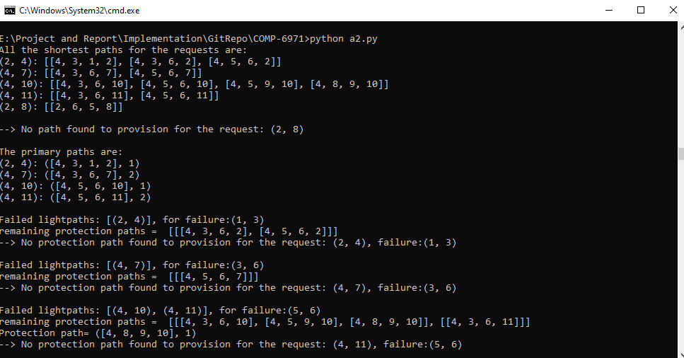

# COMP-6971

### Implementation of Algorithm:

#### Intallation
Code is written in Python3.  

First install python3. 

install all the packages listed in requirement.txt file as 
<pre><em> pip install -r requirement.txt </em></pre> 
 
#### Output
Once all the packages are installed, run the file as,  
<pre><em> python3 implementation.py</em></pre> 

It will generate the output as shown below:
